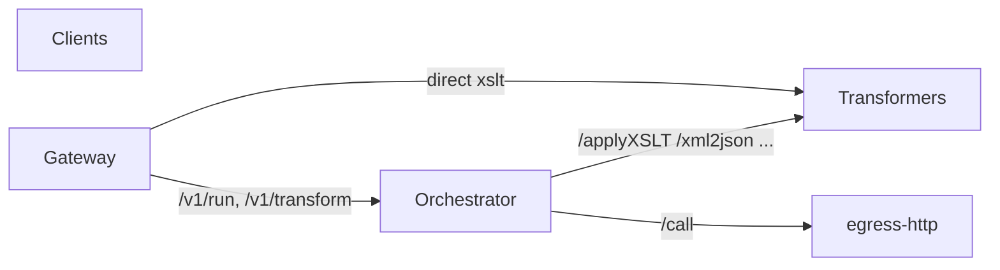

# MiniCloud

MiniCloud is a lightweight chain of microservices deployable on **Kubernetes**: a **gateway** (entry point), an **orchestrator** (YAML-driven workflows), a **transformers** service (**XSLT 1.0**, **xml2json**, **json2xml**, **Liquid**), and **egress** services for outbound **HTTP**, **FTP/FTPS**, **SSH**, and **SFTP**. The goal is similar to a minimal integration/orchestration layer (in the spirit of n8n or cloud integration), but with explicit steps and fixed building blocks.

### Additional documentation

- **[User guide: writing orchestrations](docs/user-guide-orchestrations.md)** — for workflow authors: concepts, step overview, context/`when`, examples, links to the full reference.
- **[OAuth2 / scopes (orchestrator)](docs/oauth-authorization.md)** — JWT (JWKS), scopes for workflow run + egress, IdP configuration.
- **[Workflow YAML (in depth)](docs/workflows.md)** — file conventions, `invocation`, steps, `input_from` / `body_from`, data flow.
- **[Kubernetes (in depth)](docs/kubernetes.md)** — Kustomize, ConfigMaps, images, kind script, Ingress, updates, and security notes.
- **[Deploy on Kubernetes (GitLab Registry)](docs/deployment-kubernetes-gitlab.md)** — full stack on a cluster with GitLab-built images, pull secrets, and the `deploy/k8s/overlays/gitlab` overlay.
- **[GitLab (repo + CI + registry)](docs/gitlab.md)** — creating the project, Container Registry, [`.gitlab-ci.yml`](.gitlab-ci.yml), using images in Kubernetes.
- **[Enterprise security hardening](docs/security-enterprise-hardening.md)** — checklist: identity, secrets, egress/SSRF, network, observability, supply chain, and prioritization.

---

## Table of contents

1. [Architecture](#architecture)
2. [Services](#services)
3. [Workflows (YAML)](#workflows-yaml)
4. [Invocation: HTTP vs scheduled](#invocation-http-vs-scheduled)
5. [API reference](#api-reference)
6. [Environment variables](#environment-variables)
7. [Tests (pytest)](#tests-pytest)
8. [Local run (Docker Compose)](#local-run-docker-compose)
9. [Kubernetes](#kubernetes)
10. [Examples (curl)](#examples-curl)
11. [Security and production](#security-and-production)
12. [Troubleshooting](#troubleshooting)

---

## Architecture



- **Clients** should talk only to the **gateway** (public endpoint).
- The **orchestrator** loads workflow definitions from YAML files, runs steps, and calls **transformers** (all transformations) and **egress** services (HTTP, FTP, SSH/SFTP) as needed.
- **Transformers** and **egress** services are intended as **cluster-internal** only (no Ingress to them in the default manifests).

### High-level flows

| Scenario | Route |
|----------|--------|
| Direct transform (no workflow) | `Client → Gateway → Transformers` (`/v1/transform` → `/applyXSLT`) |
| Workflow with orchestration | `Client → Gateway → Orchestrator → (transformers and/or egress)` |
| Internal / scheduled only | `CronJob or internal caller → Orchestrator` (see [scheduled invocation](#invocation-http-vs-scheduled)) |

---

## Services

| Service | Role | Default host port (Compose) |
|---------|------|------------------------------|
| **gateway** | Public API: health, direct XSLT via transformers, starting workflows (URL or JSON body). | 8080 |
| **orchestrator** | Loads `*.yaml` workflows, runs steps, enforces HTTP vs schedule policy. | 8083 |
| **transformers** | All transforms: `/applyXSLT` (XSLT 1.0), `/xml2json`, `/json2xml`, `/applyLiquid` ([python-liquid](https://pypi.org/project/python-liquid/)). | 8081 |
| **egress-http** | Outbound HTTP for workflows: `POST /call`. | 8082 |
| **egress-ftp** | Outbound FTP/FTPS: `POST /ftp`. | 8084 |
| **egress-ssh** | Outbound SSH: `POST /exec` (command); `POST /sftp` (files over SFTP). | 8085 |

---

## Workflows (YAML)

Workflow files live in a directory (in containers, default `/app/workflows`). Each workflow is one YAML document with at least a **`name`**, optional **`invocation`**, and a list of **`steps`**.

**New to authoring pipelines?** Start with the **[User guide: writing orchestrations](docs/user-guide-orchestrations.md)**; the sections below are a compact reference.

### Top level

| Field | Required | Description |
|-------|----------|-------------|
| `name` | yes | Unique workflow name; must match `.../run/{name}` on the orchestrator/gateway. |
| `invocation` | no | Who may start the workflow (see [Invocation](#invocation-http-vs-scheduled)). Default: `allow_http: true`, `allow_schedule: false`. |
| `steps` | yes | Linear step list — transforms, egress, context helpers, etc. Overview: [User guide §4](docs/user-guide-orchestrations.md#4-step-types-at-a-glance). |

### Step `type: xslt`

| Field | Required | Description |
|-------|----------|-------------|
| `type` | yes | Must be `xslt`. |
| `id` | yes | Unique id within the workflow; used by `input_from` / `body_from` of later steps. |
| `xslt` | yes | Full XSLT 1.0 stylesheet as a string (multiline with `\|`). |
| `input_from` | no | XML input source: `initial` (source document), `previous` (previous step output), or an earlier `id`. First step defaults to `initial` if omitted. |

### Step `type: http`

| Field | Required | Description |
|-------|----------|-------------|
| `type` | yes | Must be `http`. |
| `id` | yes | Unique id within the workflow. |
| `http` | yes | Object with the fields below. |

Under `http`:

| Field | Required | Description |
|-------|----------|-------------|
| `method` | no | HTTP method (default `GET`). |
| `url` | yes | Absolute target URL. |
| `headers` | no | Request header key/value pairs. |
| `body_from` | yes | Request body source: `initial`, `previous`, or a previous step `id`. |
| `timeout_seconds` | no | Outbound call timeout (limits also depend on **egress-http**). |

### Step `type: ftp`

| Field | Required | Description |
|-------|----------|-------------|
| `type` | yes | Must be `ftp`. |
| `id` | yes | Unique id within the workflow. |
| `ftp` | yes | Object with the fields below. |

Under `ftp`:

| Field | Required | Description |
|-------|----------|-------------|
| `protocol` | no | `ftp` or `ftps` (default `ftp`). |
| `host` | yes | FTP server hostname. |
| `port` | no | Default `21`. |
| `username`, `password` | no | Credentials. |
| `action` | no | `list`, `nlst`, `retrieve`, `fetch` (same as retrieve), `store`, `delete` (default `list`). |
| `remote_path` | no | Path on the server. |
| `body_from` | for `store` | File content source: `initial`, `previous`, or a previous `id`. |
| `body_encoding` | no | `utf8` or `base64` for `store` (default `utf8`). |
| `timeout_seconds` | no | Timeout (limits also on **egress-ftp**). |

Step output is the egress service **JSON** response (as a text string).

### Step `type: ssh`

| Field | Required | Description |
|-------|----------|-------------|
| `type` | yes | Must be `ssh`. |
| `id` | yes | Unique id within the workflow. |
| `ssh` | yes | Object with the fields below. |

Under `ssh`:

| Field | Required | Description |
|-------|----------|-------------|
| `host` | yes | SSH server. |
| `port` | no | Default `22`. |
| `username` | yes | |
| `password` | no | Password (unless `private_key_from`). |
| `private_key_from` | no | PEM private key from `initial` / `previous` / `<step_id>`. |
| `command` | yes | One shell command (as executed by the server). |
| `timeout_seconds` | no | |

The workflow fails if the command returns a **non-zero exit code**. Step output is JSON including `stdout`, `stderr`, `exit_status`.

### Step `type: sftp`

SFTP uses the same **egress-ssh** service as SSH (`POST /sftp`): upload/download files over SSH without a shell command.

| Field | Required | Description |
|-------|----------|-------------|
| `type` | yes | Must be `sftp`. |
| `id` | yes | Unique id within the workflow. |
| `sftp` | yes | Object with the fields below. |

Under `sftp`:

| Field | Required | Description |
|-------|----------|-------------|
| `host` | yes | SSH/SFTP server. |
| `port` | no | Default `22`. |
| `username` | yes | |
| `password` | no | Password (unless `private_key_from`). |
| `private_key_from` | no | PEM private key from `initial` / `previous` / `<step_id>`. |
| `action` | no | `list` (directory), `retrieve` or `fetch` (download file as `content_base64`), `store`, `delete` (remove file). |
| `remote_path` | no | File or directory path (default `.`). |
| `body_from` | for `store` | Content source. |
| `body_encoding` | no | `utf8` or `base64` for `store`. |
| `timeout_seconds` | no | |

Step output is JSON from the egress service.

### Step `type: xml2json`

| Field | Required | Description |
|-------|----------|-------------|
| `type` | yes | `xml2json` |
| `id` | yes | Unique id within the workflow. |
| `input_from` | no | Source **XML** (text): `initial`, `previous`, or `<step_id>`. |

Conversion uses **xmltodict**; output is a **JSON string** (suitable input for a later `liquid` step).

### Step `type: json2xml`

| Field | Required | Description |
|-------|----------|-------------|
| `type` | yes | `json2xml` |
| `id` | yes | Unique id. |
| `input_from` | no | Source **JSON** string; root must be a **JSON object** (no array at top level). |

### Step `type: liquid`

| Field | Required | Description |
|-------|----------|-------------|
| `type` | yes | `liquid` |
| `id` | yes | Unique id. |
| `template` | yes | Liquid template (string). |
| `input_from` | no | **JSON context** string (object), e.g. from `xml2json`: `initial`, `previous`, or `<step_id>`. |

Top-level JSON keys become Liquid variables (nested objects: `{{ user.name }}`). Uses **python-liquid** (Shopify-like syntax).

### Context and conditional steps (`when`)

The orchestrator keeps a **runtime context** map (string keys/values). Use **`context_key`** or **`variable`** in YAML for the same thing; refs **`context:<key>`** or **`var:<key>`**. Steps **`context_set`**, **`context_extract_*`**, **`json_set`** (write into JSON), and **`xml_set_text`** (write into XML) update data; optional **`mirror_to_context`** / **`also_variable`** stores the full document string after a write. Details: [Workflow YAML – §10.1–10.2](docs/workflows.md#101-workflow-context-orchestrator-runtime-map).

### Example files in this repository

- `services/orchestrator/workflows/demo.yaml` — XSLT then HTTP POST (external URL).
- `services/orchestrator/workflows/minimal.yaml` — XSLT only (good for offline tests).
- `services/orchestrator/workflows/transform_demo.yaml` — xml2json + Liquid (`Hello, {{ greeting.name }}`).
- `services/orchestrator/workflows/schedule_only_demo.yaml` — scheduled route only; not via HTTP trigger (see below).

---

## Invocation: HTTP vs scheduled

Workflows can restrict **who** may start them.

### `invocation` fields

```yaml
invocation:
  allow_http: true       # Gateway: POST /v1/run/... and POST /v1/run with workflow in body;
                         # Orchestrator: POST /run/... and POST /run
  allow_schedule: false  # Orchestrator: POST /invoke/scheduled
```

| Combination | Behavior |
|-------------|----------|
| `allow_http: true` | Workflow can be started via **HTTP** (gateway URL or `POST .../run` with workflow in JSON, or URL path). |
| `allow_http: false` | Same attempts return **403** with a clear message. |
| `allow_schedule: true` | Workflow may be invoked via **`POST /invoke/scheduled`** on the orchestrator (e.g. Kubernetes **CronJob**). |
| `allow_schedule: false` | Scheduled invocation returns **403**. |

This lets you run batch workflows only from an internal scheduler while interactive flows use the gateway.

### Optional Bearer tokens vs OAuth2 on the orchestrator

| Mode | Configuration |
|------|----------------|
| **Shared secret (simple)** | Set **`HTTP_INVOCATION_TOKEN`** and/or **`SCHEDULE_INVOCATION_TOKEN`**. Requires `Authorization: Bearer <secret>`. |
| **OAuth2 / OIDC (fine-grained)** | Set **`OAUTH2_ENABLED=true`**, **`OAUTH2_JWKS_URI`**, and usually **`OAUTH2_ISSUER`** / **`OAUTH2_AUDIENCE`**. The access token must be a **JWT**; scopes control **which workflows** may run and **which egress types** (`http`, `ftp`, `ssh`, `sftp`) are allowed. See **[OAuth2 / scopes](docs/oauth-authorization.md)**. |

When **`OAUTH2_ENABLED`** is on, static **`HTTP_INVOCATION_TOKEN`** / **`SCHEDULE_INVOCATION_TOKEN`** are **not** used for those routes (JWT replaces them). The gateway **forwards** `Authorization` for `/v1/run*`.

---

## API reference

### Gateway (recommended public endpoint)

Base URL with Compose: `http://localhost:8080`

| Method | Path | Body | Description |
|--------|------|------|-------------|
| GET | `/healthz` | — | Liveness. |
| GET | `/readyz` | — | Readiness. |
| GET | `/v1/status` | — | Aggregated readiness of configured backends (`GET …/readyz`); JSON includes `overall_ok`, per-service entries, and a **`tests`** block (metadata and optional GitLab links — **pytest is not run** by this endpoint; run tests in CI or locally). **Disabled (404)** when `GATEWAY_ORCHESTRATION_ONLY` is set (default in Kubernetes manifests). |
| POST | `/v1/transform` | `{"xml":"...","xslt":"..."}` | Direct XSLT; no workflow. **Disabled (404)** when `GATEWAY_ORCHESTRATION_ONLY` is set (use workflows only from the public internet). |
| POST | `/v1/run/{workflow_name}` | `{"xml":"..."}` | **Preferred HTTP entry**: workflow chosen in the URL. Forwards **`Authorization`** to the orchestrator (use when `HTTP_INVOCATION_TOKEN` is set there). |
| POST | `/v1/run` | `{"workflow":"...","xml":"..."}` | Legacy: workflow name in JSON; same Bearer forwarding. |

Responses usually include the **`X-Request-ID`** header.

### Orchestrator (cluster-internal; exposed in Compose for debugging)

Base URL with Compose: `http://localhost:8083`

| Method | Path | Body | Description |
|--------|------|------|-------------|
| GET | `/healthz` | — | Liveness. |
| GET | `/readyz` | — | Readiness; includes loaded workflow count. |
| GET | `/workflows` | — | All workflows with `invocation` metadata. |
| GET | `/workflows/http` | — | Only workflows with `allow_http: true`. |
| POST | `/run/{workflow_name}` | `{"xml":"..."}` | HTTP policy: requires `allow_http`. Optional **`Authorization: Bearer`** if `HTTP_INVOCATION_TOKEN` is set. |
| POST | `/run` | `{"workflow":"...","xml":"..."}` | Same policy as above. |
| POST | `/invoke/scheduled` | `{"workflow":"...","xml":"..."}` | Schedule policy: requires `allow_schedule`. Optional Bearer if `SCHEDULE_INVOCATION_TOKEN` is set. |

Successful workflow runs (`/run` …) return **`text/plain; charset=utf-8`** (final step may be XML, JSON text, or plain text).

### Transformers service

Base URL with Compose: `http://localhost:8081` (one service for all endpoints below).

| Method | Path | Body |
|--------|------|------|
| GET | `/healthz`, `/readyz` | — |
| POST | `/applyXSLT` | `{"xml":"...","xslt":"..."}` — **XSLT 1.0** (lxml/libxslt) |
| POST | `/xml2json` | `{"xml":"..."}` → **JSON** response |
| POST | `/json2xml` | `{"json":"..."}` (string with JSON object root) → **XML** response |
| POST | `/applyLiquid` | `{"template":"...","json":"..."}` (context as JSON string) → **plain text** |

### Egress HTTP service

| Method | Path | Body |
|--------|------|------|
| GET | `/healthz`, `/readyz` | — |
| POST | `/call` | `{"method":"GET","url":"https://...","headers":{},"body":"...","timeout_seconds":60}` |

Response is JSON with `status_code`, `headers`, `body` (text).

---

## Environment variables

### Gateway

| Variable | Default | Meaning |
|----------|---------|---------|
| `GATEWAY_ORCHESTRATION_ONLY` | *(empty)* | If `true` / `1` / `yes`: **`POST /v1/transform`** and **`GET /v1/status`** return **404**; only **`POST /v1/run*`** (orchestration) is exposed. Kubernetes manifests set this for a minimal public surface. |
| `TRANSFORMERS_URL` | `http://localhost:8081` | Transformers service base URL (e.g. `/applyXSLT`). |
| `TRANSFORMERS_APPLY_PATH` | `/applyXSLT` | Path for direct XSLT via gateway (`POST /v1/transform`). |
| `TRANSFORMERS_TIMEOUT_SECONDS` | `60` | Timeout for `/v1/transform`. |
| `ORCHESTRATOR_URL` | *(empty)* | If empty: `POST /v1/run*` returns 503. |
| `ORCHESTRATOR_RUN_PATH` | `/run` | Path for legacy `POST /v1/run`. |
| `ORCHESTRATOR_TIMEOUT_SECONDS` | `120` | Timeout to orchestrator. |
| `STATUS_PROBE_TIMEOUT_SECONDS` | `3` | Per-request timeout for each backend probe in `GET /v1/status`. |
| `EGRESS_HTTP_URL`, `EGRESS_FTP_URL`, `EGRESS_SSH_URL` | *(empty)* | If set on the gateway, included in `/v1/status` (optional; orchestrator already has its own egress config). |
| `GITLAB_PIPELINE_URL`, `GITLAB_PROJECT_URL` | *(empty)* | Optional links in the `/v1/status` **`tests`** block. |
| `LOG_LEVEL` | `INFO` | Log level. |

### Orchestrator

| Variable | Default | Meaning |
|----------|---------|---------|
| `WORKFLOWS_DIR` | `/app/workflows` | Directory of `*.yaml` / `*.yml` workflows. |
| `TRANSFORMERS_URL` | `http://localhost:8081` | All transforms (`/applyXSLT`, `/xml2json`, …). |
| `EGRESS_HTTP_URL`, `EGRESS_HTTP_PATH` | see code | Base URL and path for outbound HTTP (`…/call`). Legacy: `HTTP_CALL_URL` / `HTTP_CALL_PATH`. |
| `EGRESS_FTP_URL` | see code | **egress-ftp** base URL (orchestrator appends `/ftp`). |
| `EGRESS_SSH_URL` | see code | **egress-ssh** base URL (orchestrator appends `/exec` and `/sftp`). |
| `ORCH_TIMEOUT_SECONDS` | `120` | HTTP client timeout per workflow run. |
| `HTTP_INVOCATION_TOKEN` | *(empty)* | If set (and **`OAUTH2_ENABLED`** is off): shared-secret Bearer on **`POST /run`**. |
| `SCHEDULE_INVOCATION_TOKEN` | *(empty)* | If set (and OAuth not used for scheduled): Bearer on **`POST /invoke/scheduled`**. |
| `OAUTH2_ENABLED` | `false` | If `true`: validate JWT via JWKS; enforce scopes (see **[oauth-authorization.md](docs/oauth-authorization.md)**). |
| `OAUTH2_JWKS_URI` | *(empty)* | JWKS URL (required if OAuth enabled). |
| `OAUTH2_ISSUER`, `OAUTH2_AUDIENCE` | *(empty)* | JWT `iss` / `aud` validation (recommended). |
| `OAUTH2_SCOPE_PREFIX` | `minicloud` | Prefix for scope strings in tokens. |
| `OAUTH2_APPLY_TO_SCHEDULED` | `true` | If `false` with OAuth on, scheduled route uses **`SCHEDULE_INVOCATION_TOKEN`** only (no egress scope checks on that path). |
| `LOG_LEVEL` | `INFO` | |

### Egress HTTP

| Variable | Default | Meaning |
|----------|---------|---------|
| `HTTP_EGRESS_TIMEOUT_SECONDS` | `60` | Default timeout per request. |
| `HTTP_EGRESS_MAX_RESPONSE_BYTES` | `10485760` | Max response size. |
| `HTTP_EGRESS_ALLOWED_HOSTS` | *(empty)* | Comma-separated hostnames; empty = no host filter (mind SSRF). |

### Egress FTP

| Variable | Default | Meaning |
|----------|---------|---------|
| `FTP_EGRESS_TIMEOUT_SECONDS` | `60` | Default timeout. |
| `FTP_EGRESS_ALLOWED_HOSTS` | *(empty)* | Allowed FTP hostnames (empty = no filter). |

### Egress SSH

| Variable | Default | Meaning |
|----------|---------|---------|
| `SSH_EGRESS_TIMEOUT_SECONDS` | `60` | Default timeout. |
| `SSH_EGRESS_ALLOWED_HOSTS` | *(empty)* | Allowed SSH hostnames (empty = no filter). |

### Transformers

| Variable | Default | Meaning |
|----------|---------|---------|
| `LOG_LEVEL` | `INFO` | |

---

## Tests (pytest)

Locally (no Docker required for the suite):

```bash
./scripts/run-tests.sh
```

Manual: `python3 -m venv .venv && .venv/bin/pip install -r tests/requirements.txt && .venv/bin/pytest tests/ -v`

- **Each service**: `healthz` / `readyz` and, where needed, one API path with a **mocked** upstream (HTTP egress, gateway → transformers).
- **Orchestration**: workflow **`minimal`** (XSLT only) with real **transformers** in-process via `httpx.ASGITransport` (no external egress).

---

## Local run (Docker Compose)

From the repository root:

```bash
docker compose build
docker compose up -d
```

Host ports:

| Port | Service |
|------|---------|
| 8080 | gateway |
| 8081 | transformers |
| 8082 | egress-http |
| 8083 | orchestrator |
| 8084 | egress-ftp |
| 8085 | egress-ssh |

Workflows are bind-mounted from `services/orchestrator/workflows` (read-only). YAML changes are visible after restarting the orchestrator container (or rebuild if workflows are baked into the image).

---

## Kubernetes

- Manifests live under **`deploy/k8s/`** (Kustomize).
- **GitLab Container Registry**: full-cluster deploy (images, pull secrets, overlay) is documented in **[docs/deployment-kubernetes-gitlab.md](docs/deployment-kubernetes-gitlab.md)** (`deploy/k8s/overlays/gitlab/`).
- Build and load images into **kind** with **`deploy/k8s/local-kind.sh`** (requires Docker, kind, kubectl).
- Workflows are generated as a **ConfigMap** (`minicloud-workflows`) from `deploy/k8s/workflows/*.yaml` and mounted on the orchestrator.
- **Ingress** (optional) points at the **gateway**; transformers, orchestrator, and egress services are **ClusterIP** only.
- **`deploy/k8s/gateway-deployment.yaml`** sets e.g. `ORCHESTRATOR_URL=http://orchestrator:8080`.

### Deploy workflow (GitLab Registry)

1. **Configureer** `deploy/k8s/scripts/deploy-config.local.env` (kopieer van `deploy-config.example.env`).
2. **Docker login** naar de registry: `docker login registry.gitlab.com`
3. **Bouw en push** alle images:
   ```bash
   bash deploy/k8s/scripts/build-and-push.sh
   ```
   Of één specifieke service: `bash deploy/k8s/scripts/build-and-push.sh gateway`
4. **Deploy** naar het cluster:
   ```bash
   bash deploy/k8s/scripts/gitlab-deploy.sh
   ```

### Security hardening (deployment manifests)

Alle deployment-manifesten zijn gehardend met:
- **Pod-level**: `runAsNonRoot: true`, `runAsUser: 10001`, `runAsGroup: 10001`, `fsGroup: 10001`
- **Container-level**: `allowPrivilegeEscalation: false`, `readOnlyRootFilesystem: true`, `capabilities: { drop: [ALL] }`

Dit komt overeen met UID 10001 (`appuser`) uit de Dockerfiles. Zie [docs/security-enterprise-hardening.md](docs/security-enterprise-hardening.md) voor de volledige checklist.

### Direct apply

```bash
kubectl apply -k deploy/k8s
```

Without Ingress, access the gateway e.g. with:

```bash
kubectl port-forward svc/gateway 8080:8080
```

---

## Examples (curl)

**Gateway health:**

```bash
curl -s http://127.0.0.1:8080/healthz
```

**Direct XSLT transform:**

```bash
curl -s -X POST http://127.0.0.1:8080/v1/transform \
  -H 'Content-Type: application/json' \
  -d '{"xml":"<?xml version=\"1.0\"?><r/>","xslt":"<?xml version=\"1.0\"?><xsl:stylesheet version=\"1.0\" xmlns:xsl=\"http://www.w3.org/1999/XSL/Transform\"><xsl:template match=\"/\"><ok/></xsl:template></xsl:stylesheet>"}'
```

**Workflow via URL entry (recommended):**

```bash
curl -s -X POST http://127.0.0.1:8080/v1/run/minimal \
  -H 'Content-Type: application/json' \
  -d '{"xml":"<?xml version=\"1.0\"?><root/>"}'
```

**Workflow with xml2json + Liquid (`transform_demo`):**

```bash
curl -s -X POST http://127.0.0.1:8080/v1/run/transform_demo \
  -H 'Content-Type: application/json' \
  -d '{"xml":"<?xml version=\"1.0\"?><greeting><name>MiniCloud</name></greeting>"}'
```

**Legacy workflow (name in body):**

```bash
curl -s -X POST http://127.0.0.1:8080/v1/run \
  -H 'Content-Type: application/json' \
  -d '{"workflow":"minimal","xml":"<?xml version=\"1.0\"?><root/>"}'
```

**List HTTP-allowed workflows (orchestrator):**

```bash
curl -s http://127.0.0.1:8083/workflows/http
```

**Scheduled route (only `allow_schedule: true`):**

```bash
curl -s -X POST http://127.0.0.1:8083/invoke/scheduled \
  -H 'Content-Type: application/json' \
  -d '{"workflow":"schedule_only_demo","xml":"<?xml version=\"1.0\"?><r/>"}'
```

---

## Security and production

- For a structured **enterprise-oriented** checklist (OAuth, secrets, SSRF, mTLS, audit logging, supply chain), see **[docs/security-enterprise-hardening.md](docs/security-enterprise-hardening.md)**.
- Do not expose the orchestrator or egress services directly on the internet; use **Ingress only to the gateway**.
- Consider **`HTTP_EGRESS_ALLOWED_HOSTS`** on **egress-http** to restrict outbound URLs (SSRF).
- Use **`SCHEDULE_INVOCATION_TOKEN`** if `/invoke/scheduled` is reachable inside the cluster but not for everyone.
- Add **NetworkPolicies** so only the gateway talks to the orchestrator and only the orchestrator talks to transformers and egress (where your cluster supports it).
- Consider **request size limits** and authentication on the gateway for production (out of scope for this MVP code).

---

## Troubleshooting

| Symptom | Likely cause |
|---------|----------------|
| 503 on `/v1/run` | `ORCHESTRATOR_URL` not set on the gateway. |
| 403 “not invokable via HTTP” | Workflow has `allow_http: false` (use the scheduled route or set `allow_http: true`). |
| 403 on `/invoke/scheduled` | Workflow has `allow_schedule: false`, or wrong/missing Bearer token (if `SCHEDULE_INVOCATION_TOKEN` is set). |
| 401/403 on **`POST /run`** (or gateway `/v1/run`) | `HTTP_INVOCATION_TOKEN` is set but `Authorization` is missing or wrong. |
| 404 unknown workflow | `name` in YAML does not match URL/JSON, or ConfigMap in K8s not updated. |
| Empty workflow list | Orchestrator does not see `WORKFLOWS_DIR`, or YAML parse errors (check orchestrator logs). |
| Step timeouts | Raise `ORCH_TIMEOUT_SECONDS` / step timeouts; check network to external URLs. |

---

## License and contributions

See [`LICENSE`](LICENSE): permissive use with **notice** for production use or redistribution, an **expectation to share improvements** back, and a standard **no-warranty / no-liability** disclaimer. Replace the copyright holder and contact placeholders in `LICENSE` with your details.
