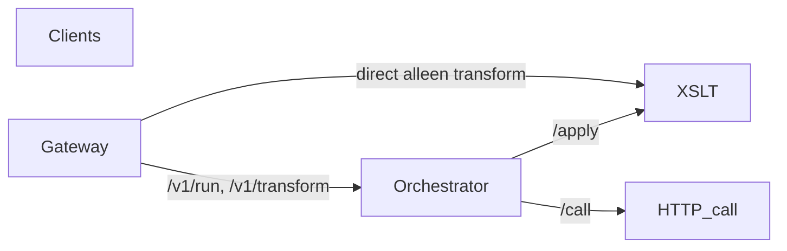

# MiniCloud

MiniCloud is een lichtgewicht, op **Kubernetes** te deployen keten van microservices: een **gateway** (trigger), een **orchestrator** (workflow op basis van YAML), een **XSLT-transformservice** en een **HTTP-call** service. Het doel is vergelijkbaar met een minimale integratie-/orchestratielaag (in de geest van n8n of cloud integration), maar met expliciete stappen en vaste bouwstenen.

### Aanvullende documentatie

- **[Workflow-YAML (diepgaand)](docs/workflows.md)** — bestandsconventies, `invocation`, stappen, `input_from` / `body_from`, datastroom.
- **[Kubernetes (diepgaand)](docs/kubernetes.md)** — Kustomize, ConfigMaps, images, kind-script, Ingress, updates en security-richtlijnen.
- **[GitLab (repo + CI + registry)](docs/gitlab.md)** — project aanmaken, Container Registry, [`.gitlab-ci.yml`](.gitlab-ci.yml), images in Kubernetes gebruiken.

---

## Inhoudsopgave

1. [Architectuur](#architectuur)
2. [Services](#services)
3. [Workflows (YAML)](#workflows-yaml)
4. [Invocatie: HTTP versus gepland](#invocatie-http-versus-gepland)
5. [API-referentie](#api-referentie)
6. [Omgevingsvariabelen](#omgevingsvariabelen)
7. [Lokaal draaien (Docker Compose)](#lokaal-draaien-docker-compose)
8. [Kubernetes](#kubernetes)
9. [Voorbeelden (curl)](#voorbeelden-curl)
10. [Beveiliging en productie](#beveiliging-en-productie)
11. [Troubleshooting](#troubleshooting)

---

## Architectuur



- **Clients** spreken bij voorkeur alleen de **gateway** aan (publiek endpoint).
- **Orchestrator** laadt workflowdefinities uit YAML-bestanden, voert stappen uit en roept daarbij **XSLT** en **HTTP call** aan.
- **XSLT** en **HTTP call** zijn bedoeld als **cluster-interne** services (geen Ingress naar deze services in de standaardmanifesten).

### Stroom op hoofdlijnen

| Scenario | Route |
|----------|--------|
| Direct transformeren (geen workflow) | `Client → Gateway → XSLT` |
| Workflow met orchestratie | `Client → Gateway → Orchestrator → (XSLT en/of HTTP call)` |
| Alleen intern / gepland | `CronJob of interne caller → Orchestrator` (zie [geplande invocatie](#invocatie-http-versus-gepland)) |

---

## Services

| Service | Rol | Standaardpoort (Compose) |
|---------|-----|---------------------------|
| **gateway** | Publieke API: health, directe XSLT-transform, starten van workflows (URL of JSON-body). | 8080 |
| **orchestrator** | Laadt `*.yaml` workflows, voert stappen uit, handhaaft HTTP- versus schedule-policy. | 8083 |
| **xslt** | Stateless XSLT 1.0 (libxslt/lxml): één endpoint `/apply`. | 8081 |
| **httpcall** | Uitgaande HTTP-requests namens workflows: één endpoint `/call`. | 8082 |

---

## Workflows (YAML)

Workflowbestanden staan in een map (in containers: standaard `/app/workflows`). Elke workflow is een YAML-document met minimaal een **`name`**, optioneel **`invocation`**, en een lijst **`steps`**.

### Topniveau

| Veld | Verplicht | Beschrijving |
|------|-----------|--------------|
| `name` | ja | Unieke naam van de workflow; moet overeenkomen met het pad `.../run/{name}` op de orchestrator/gateway. |
| `invocation` | nee | Wie de workflow mag starten (zie [Invocatie](#invocatie-http-versus-gepland)). Standaard: `allow_http: true`, `allow_schedule: false`. |
| `steps` | ja | Lijst van stappen (`xslt` of `http`). |

### Stap `type: xslt`

| Veld | Verplicht | Beschrijving |
|------|-----------|--------------|
| `type` | ja | Moet `xslt` zijn. |
| `id` | ja | Unieke id binnen de workflow; nodig voor `input_from` / `body_from` van latere stappen. |
| `xslt` | ja | Volledige XSLT 1.0-stylesheet als string (meerregelig met `\|`). |
| `input_from` | nee | Waar de XML-input vandaan komt: `initial` (brondocument), `previous` (uitvoer vorige stap), of een eerdere `id`. Eerste stap: standaard `initial` als niet gezet. |

### Stap `type: http`

| Veld | Verplicht | Beschrijving |
|------|-----------|--------------|
| `type` | ja | Moet `http` zijn. |
| `id` | ja | Unieke id binnen de workflow. |
| `http` | ja | Object met onderstaande velden. |

Onder `http`:

| Veld | Verplicht | Beschrijving |
|------|-----------|--------------|
| `method` | nee | HTTP-methode (standaard `GET`). |
| `url` | ja | Absolute URL van het doel. |
| `headers` | nee | Sleutel-waardeparen voor requestheaders. |
| `body_from` | ja | Bron van de requestbody: `initial`, `previous`, of een `id` van een eerdere stap. |
| `timeout_seconds` | nee | Timeout voor de uitgaande call (grenzen zoals geconfigureerd op de httpcall-service). |

### Voorbeeldbestanden in deze repository

- `services/orchestrator/workflows/demo.yaml` — XSLT gevolgd door HTTP POST (externe URL).
- `services/orchestrator/workflows/minimal.yaml` — alleen XSLT (geschikt voor offline tests).
- `services/orchestrator/workflows/schedule_only_demo.yaml` — alleen via geplande route; niet via HTTP-trigger (zie hieronder).

---

## Invocatie: HTTP versus gepland

Workflows kunnen afzonderlijk worden ingesteld voor **wie** ze mag starten.

### `invocation`-velden

```yaml
invocation:
  allow_http: true       # Gateway: POST /v1/run/... en POST /v1/run met workflow in body;
                         # Orchestrator: POST /run/... en POST /run
  allow_schedule: false  # Orchestrator: POST /invoke/scheduled
```

| Combinatie | Gedrag |
|------------|--------|
| `allow_http: true` | Workflow is te starten via de **HTTP-entry** (gateway-URL of `POST .../run` met workflow in JSON, of URL-pad). |
| `allow_http: false` | Zelfde pogingen krijgen **403** met een duidelijke fouttekst. |
| `allow_schedule: true` | Workflow mag via **`POST /invoke/scheduled`** op de orchestrator (bijv. Kubernetes **CronJob**). |
| `allow_schedule: false` | Geplande aanroep krijgt **403**. |

Zo kun je bijvoorbeeld batch-workflows alleen via een interne scheduler laten lopen, terwijl interactieve flows via de gateway blijven gaan.

### Optioneel: token op geplande route

Als de omgevingsvariabele **`SCHEDULE_INVOCATION_TOKEN`** op de orchestrator is gezet, moet **`POST /invoke/scheduled`** de header **`Authorization: Bearer <token>`** meesturen. Is de variabele leeg, dan is er geen token-check (vertrouw in productie op **NetworkPolicy**, geen publieke Ingress, of zet een token).

---

## API-referentie

### Gateway (aanbevolen publiek endpoint)

Basis-URL in Compose: `http://localhost:8080`

| Methode | Pad | Body | Beschrijving |
|---------|-----|------|--------------|
| GET | `/healthz` | — | Liveness. |
| GET | `/readyz` | — | Readiness. |
| POST | `/v1/transform` | `{"xml":"...","xslt":"..."}` | Direct naar XSLT; geen workflow. |
| POST | `/v1/run/{workflow_name}` | `{"xml":"...}` | **Aanbevolen HTTP-entry**: workflow gekozen via URL. |
| POST | `/v1/run` | `{"workflow":"...","xml":"..."}` | Legacy: workflownaam in JSON. |

Antwoorden bevatten doorgaans de header **`X-Request-ID`**.

### Orchestrator (cluster-intern; wel blootgesteld in Compose voor debugging)

Basis-URL in Compose: `http://localhost:8083`

| Methode | Pad | Body | Beschrijving |
|---------|-----|------|--------------|
| GET | `/healthz` | — | Liveness. |
| GET | `/readyz` | — | Readiness; bevat o.a. aantal geladen workflows. |
| GET | `/workflows` | — | Alle workflows met `invocation`-metadata. |
| GET | `/workflows/http` | — | Alleen workflows met `allow_http: true`. |
| POST | `/run/{workflow_name}` | `{"xml":"..."}` | HTTP-policy: vereist `allow_http`. |
| POST | `/run` | `{"workflow":"...","xml":"..."}` | Zelfde policy als hierboven. |
| POST | `/invoke/scheduled` | `{"workflow":"...","xml":"..."}` | Schedule-policy: vereist `allow_schedule`; optioneel Bearer-token. |

### XSLT-service

| Methode | Pad | Body |
|---------|-----|------|
| GET | `/healthz`, `/readyz` | — |
| POST | `/apply` | `{"xml":"...","xslt":"..."}` |

Engine: **XSLT 1.0** (lxml/libxslt).

### HTTP-call-service

| Methode | Pad | Body |
|---------|-----|------|
| GET | `/healthz`, `/readyz` | — |
| POST | `/call` | `{"method":"GET","url":"https://...","headers":{},"body":"...","timeout_seconds":60}` |

Response is JSON met o.a. `status_code`, `headers`, `body` (tekst).

---

## Omgevingsvariabelen

### Gateway

| Variabele | Standaard | Betekenis |
|-----------|-----------|-----------|
| `XSLT_URL` | `http://localhost:8081` | Basis-URL van de XSLT-service. |
| `XSLT_APPLY_PATH` | `/apply` | Pad voor `/apply`. |
| `XSLT_TIMEOUT_SECONDS` | `60` | Timeout voor directe transform. |
| `ORCHESTRATOR_URL` | *(leeg)* | Als leeg: `POST /v1/run*` geeft 503. |
| `ORCHESTRATOR_RUN_PATH` | `/run` | Pad voor legacy `POST /v1/run`. |
| `ORCHESTRATOR_TIMEOUT_SECONDS` | `120` | Timeout naar orchestrator. |
| `LOG_LEVEL` | `INFO` | Logniveau. |

### Orchestrator

| Variabele | Standaard | Betekenis |
|-----------|-----------|-----------|
| `WORKFLOWS_DIR` | `/app/workflows` | Map met `*.yaml` / `*.yml` workflows. |
| `XSLT_URL`, `XSLT_APPLY_PATH` | zie code | XSLT upstream. |
| `HTTP_CALL_URL`, `HTTP_CALL_PATH` | zie code | HTTP-call upstream. |
| `ORCH_TIMEOUT_SECONDS` | `120` | HTTP-client timeout per workflow-run. |
| `SCHEDULE_INVOCATION_TOKEN` | *(leeg)* | Zo gezet: Bearer verplicht op `/invoke/scheduled`. |
| `LOG_LEVEL` | `INFO` | |

### HTTP-call

| Variabele | Standaard | Betekenis |
|-----------|-----------|-----------|
| `HTTP_CALL_TIMEOUT_SECONDS` | `60` | Standaard timeout. |
| `HTTP_CALL_MAX_RESPONSE_BYTES` | `10485760` | Max. responsegrootte. |
| `HTTP_ALLOWED_HOSTS` | *(leeg)* | Comma-gescheiden hostnamen; leeg = geen host-filter (let op SSRF-risico). |

### XSLT

| Variabele | Standaard | Betekenis |
|-----------|-----------|-----------|
| `LOG_LEVEL` | `INFO` | |

---

## Lokaal draaien (Docker Compose)

Vanuit de repository-root:

```bash
docker compose build
docker compose up -d
```

Poorten (host):

| Poort | Service |
|-------|---------|
| 8080 | gateway |
| 8081 | xslt |
| 8082 | httpcall |
| 8083 | orchestrator |

Workflows worden in Compose gemount vanuit `services/orchestrator/workflows` (read-only). Wijzigingen in YAML zijn na een herstart van de orchestrator-container zichtbaar (of herbouw indien de map in de image zit).

---

## Kubernetes

- Manifesten staan onder **`deploy/k8s/`** (Kustomize).
- Bouwen en laden van images naar **kind** kan met **`deploy/k8s/local-kind.sh`** (vereist Docker, kind, kubectl).
- Workflows worden als **ConfigMap** (`minicloud-workflows`) gegenereerd uit `deploy/k8s/workflows/*.yaml` en als volume op de orchestrator gemount.
- De **Ingress** (optioneel) wijst naar de **gateway**; XSLT, orchestrator en httpcall zijn bedoeld als **ClusterIP** alleen.
- In **`deploy/k8s/gateway-deployment.yaml`** staat o.a. `ORCHESTRATOR_URL=http://orchestrator:8080`.

Toepassen (met kubectl):

```bash
kubectl apply -k deploy/k8s
```

Zonder Ingress: toegang tot de gateway bijvoorbeeld met:

```bash
kubectl port-forward svc/gateway 8080:8080
```

---

## Voorbeelden (curl)

**Health gateway:**

```bash
curl -s http://127.0.0.1:8080/healthz
```

**Directe XSLT-transform:**

```bash
curl -s -X POST http://127.0.0.1:8080/v1/transform \
  -H 'Content-Type: application/json' \
  -d '{"xml":"<?xml version=\"1.0\"?><r/>","xslt":"<?xml version=\"1.0\"?><xsl:stylesheet version=\"1.0\" xmlns:xsl=\"http://www.w3.org/1999/XSL/Transform\"><xsl:template match=\"/\"><ok/></xsl:template></xsl:stylesheet>"}'
```

**Workflow via URL-entry (aanbevolen):**

```bash
curl -s -X POST http://127.0.0.1:8080/v1/run/minimal \
  -H 'Content-Type: application/json' \
  -d '{"xml":"<?xml version=\"1.0\"?><root/>"}'
```

**Workflow legacy (naam in body):**

```bash
curl -s -X POST http://127.0.0.1:8080/v1/run \
  -H 'Content-Type: application/json' \
  -d '{"workflow":"minimal","xml":"<?xml version=\"1.0\"?><root/>"}'
```

**Lijst HTTP-toegestane workflows (orchestrator):**

```bash
curl -s http://127.0.0.1:8083/workflows/http
```

**Geplande route (alleen `allow_schedule: true`):**

```bash
curl -s -X POST http://127.0.0.1:8083/invoke/scheduled \
  -H 'Content-Type: application/json' \
  -d '{"workflow":"schedule_only_demo","xml":"<?xml version=\"1.0\"?><r/>"}'
```

---

## Beveiliging en productie

- Zet **geen** onbeveiligde orchestrator of httpcall rechtstreeks op internet; gebruik **Ingress alleen naar de gateway**.
- Overweeg **`HTTP_ALLOWED_HOSTS`** op de httpcall-service om uitgaande URLs te beperken (SSRF).
- Gebruik **`SCHEDULE_INVOCATION_TOKEN`** als `/invoke/scheduled` bereikbaar is binnen het cluster maar niet voor iedereen.
- Voeg **NetworkPolicies** toe zodat alleen de gateway naar de orchestrator mag praten en alleen de orchestrator naar xslt/httpcall (naarmate je cluster dat ondersteunt).
- Overweeg **request size limits** en authenticatie op de gateway voor productie (nu niet in scope van de MVP-code).

---

## Troubleshooting

| Symptoom | Mogelijke oorzaak |
|----------|-------------------|
| 503 op `/v1/run` | `ORCHESTRATOR_URL` niet gezet op de gateway. |
| 403 “not invokable via HTTP” | Workflow heeft `allow_http: false` (gebruik geplande route of zet `allow_http: true`). |
| 403 op `/invoke/scheduled` | Workflow heeft `allow_schedule: false`, of verkeerde/missende Bearer-token. |
| 404 onbekende workflow | `name` in YAML komt niet overeen met URL/JSON, of ConfigMap in K8s niet bijgewerkt. |
| Lege workflowlijst | Orchestrator ziet `WORKFLOWS_DIR` niet, of YAML-syntaxisfouten (zie orchestrator-logs). |
| Timeout bij stappen | Verhoog `ORCH_TIMEOUT_SECONDS` / stap-timeouts; controleer netwerk naar externe URLs. |

---

## Licentie en bijdragen

Dit project is een referentie-implementatie; licentie niet gespecificeerd. Pas aan naar je eigen beleid.
