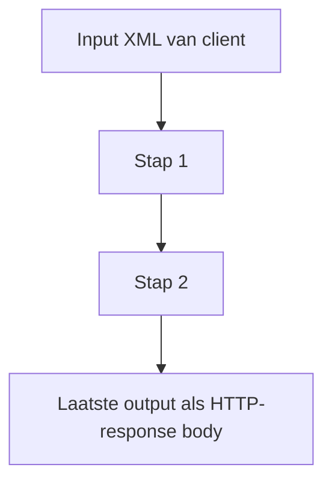

# Workflow-YAML (diepgaand)

Dit document vult de [README](../README.md) aan met details over het workflowmodel, data tussen stappen, en invocatie.

---

## 1. Bestandsconventies

- **Locatie**: in containers leest de orchestrator uit `WORKFLOWS_DIR` (standaard `/app/workflows`).
- **Bestandsnamen**: `*.yaml` of `*.yml`; de **bestandsnaam** hoeft niet gelijk te zijn aan `name:` in het bestand (wel moet `name` uniek zijn over alle workflows).
- **Laden**: bij **startup** van de orchestrator worden alle geldige bestanden ingelezen. Wijzigingen vereisen een **pod-herstart** (of nieuwe deployment) tenzij je workflows via volume/ConfigMap extern bijwerkt en de pod herstart.

---

## 2. Topniveau-schema

```yaml
name: <string>                    # verplicht, uniek
invocation:                       # optioneel
  allow_http: <bool>              # default: true
  allow_schedule: <bool>          # default: false
steps:
  - # zie §3 en §4
```

### 2.1 `name`

- Moet exact overeenkomen met hoe je de workflow start:
  - URL-pad: `POST /v1/run/{name}` op de gateway, of `POST /run/{name}` op de orchestrator.
  - JSON-body: veld `workflow` in `POST /v1/run` en `POST /run`.
- Gebruik bij voorkeur **ASCII**, letters/cijfers en eventueel `-` of `_`. Speciale tekens in URLs vereisen **URL-encoding** aan clientzijde.

### 2.2 `invocation`

| Veld | Default | Betekenis |
|------|---------|-----------|
| `allow_http` | `true` | Mag via HTTP-trigger: gateway (`/v1/run/...`), orchestrator `POST /run` en `POST /run/{name}`. |
| `allow_schedule` | `false` | Mag via `POST /invoke/scheduled` op de orchestrator (CronJob, interne worker). |

**Combinaties** (veel voorkomend):

- Alleen interactief via gateway: `allow_http: true`, `allow_schedule: false`.
- Alleen batch/cron: `allow_http: false`, `allow_schedule: true`.
- Beide (zeldzaam): beide `true`.

---

## 3. Stap `type: xslt`

```yaml
- id: <string>           # verplicht, uniek binnen de workflow
  type: xslt
  xslt: |                # verplicht: volledige stylesheet (XSLT 1.0)
    <?xml version="1.0"?>
    <xsl:stylesheet ...>
      ...
    </xsl:stylesheet>
  input_from: <ref>      # optioneel; zie §5
```

- De orchestrator stuurt naar de XSLT-service: `xml` = opgeloste input, `xslt` = bovenstaande string.
- **Engine**: XSLT **1.0** (libxslt via lxml). XSLT 2.0/3.0 is in deze stack niet geïmplementeerd.

---

## 4. Stap `type: http`

```yaml
- id: <string>
  type: http
  http:
    method: <string>           # optioneel, default GET
    url: <string>              # verplicht, absolute URL
    headers: { <string>: ... } # optioneel
    body_from: <ref>           # verplicht; zie §5
    timeout_seconds: <number>  # optioneel
```

- De orchestrator roept de **httpcall**-service aan; die voert de echte HTTP-request uit.
- De **response body** (tekst) van de downstream HTTP-call wordt als string bewaard onder deze stap-`id` en wordt de **previous** output voor volgende stappen.

---

## 5. Verwijzingen: `input_from` en `body_from`

`<ref>` is één van:

| Waarde | Betekenis |
|--------|-----------|
| `initial` | Het **brondocument** dat bij de run is meegegeven (`xml` in de API). |
| `previous` | De uitvoer van de **direct voorafgaande** stap (tekst). |
| `<step_id>` | De opgeslagen uitvoer van de stap met dat `id` (moet een **eerdere** stap zijn). |

**Standaardgedrag** als `input_from` bij een **xslt**-stap ontbreekt:

- Eerste stap in de lijst: alsof `initial`.
- Latere stappen: alsof `previous`.

Voor **http** is `body_from` **verplicht** expliciet (geen impliciete default zoals bij eerste xslt-stap).

### 5.1 Fouten

- Verwijzing naar onbekende `id` → fout tijdens uitvoering (502 met toelichting in logs).
- HTTP-stap met niet-2xx statuscode → run faalt (zie orchestrator-gedrag).

---

## 6. Datastroom tussen stappen (conceptueel)



Elke stap schrijft een **string** weg (XML of andere tekst). Alleen die string wordt doorgegeven volgens `input_from` / `body_from`.

---

## 7. Validatie (samenvatting)

- **Unieke `id`** per stap binnen één workflow.
- **Unieke `name`** per workflow over alle geladen bestanden.
- **YAML-parsefouten** of pydantic-validatiefouten: bestand wordt overgeslagen; zie orchestrator-logs bij startup.

---

## 8. Voorbeelden in de repository

| Bestand | Doel |
|---------|------|
| `services/orchestrator/workflows/minimal.yaml` | Eén XSLT-stap; geschikt voor offline test via `POST /v1/run/minimal`. |
| `services/orchestrator/workflows/demo.yaml` | XSLT + HTTP naar extern endpoint (vereist netwerk). |
| `services/orchestrator/workflows/schedule_only_demo.yaml` | Alleen `allow_schedule`; test `POST /invoke/scheduled`. |

---

## 9. OpenAPI / JSON-schema

De HTTP-API’s van gateway en orchestrator zijn te bekijken via de FastAPI **OpenAPI**-docs op elke service (`/docs`), mits je die in productie niet publiek exposeert zonder authenticatie.

Terug naar [README – Workflows](../README.md#workflows-yaml).
