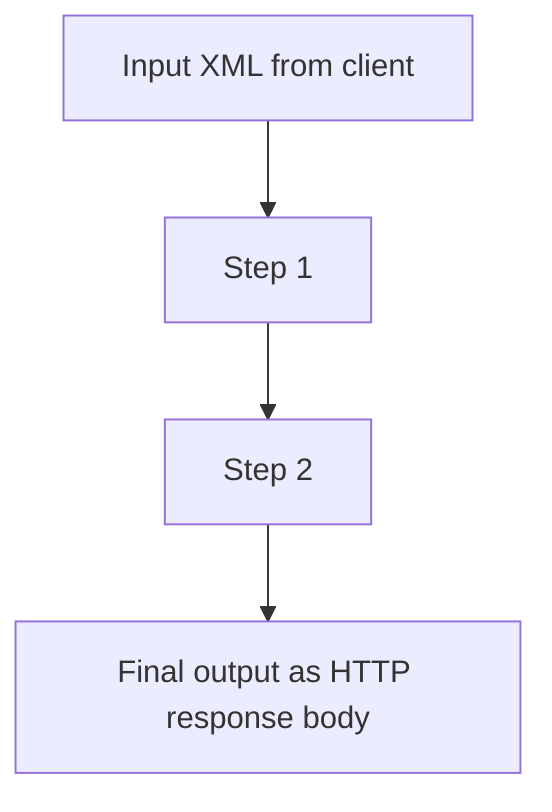

# Workflow YAML (in depth)

This document supplements the [README](../README.md) with details on the workflow model, data between steps, and invocation.

**Author-oriented overview:** if you are writing workflows for the first time, read **[User guide: writing orchestrations](user-guide-orchestrations.md)** first, then use this file as the full reference. To deploy, update, or delete workflows without restarting the cluster, see **[Workflow deployment](workflow-deployment.md)**.

---

## 1. File conventions

- **Location**: in containers the orchestrator reads from `WORKFLOWS_DIR` (default `/app/workflows`), or — when `ORCH_RUNTIME_STORE=http` is set — from the storage service at runtime. See [Workflow deployment](workflow-deployment.md).
- **Filenames**: `*.yaml` or `*.yml`; the **filename** does not have to match `name:` in the file (but `name` must be unique across all workflows).
- **Loading**: at **startup** the orchestrator loads all valid files. With `ORCH_RUNTIME_STORE=http`, call `POST /admin/reload` to activate a new or updated workflow without any pod restart.

---

## 2. Top-level schema

```yaml
name: <string>                    # required, unique
invocation:                       # optional
  allow_http: <bool>              # default: true
  allow_schedule: <bool>          # default: false
steps:
  - # see §3 onward
```

### 2.1 `name`

- Must match exactly how you start the workflow:
  - URL path: `POST /v1/run/{name}` on the gateway, or `POST /run/{name}` on the orchestrator.
  - JSON body: field `workflow` in `POST /v1/run` and `POST /run`.
- Prefer **ASCII**, letters/digits and optionally `-` or `_`. Special characters in URLs require **URL encoding** on the client.

### 2.2 `invocation`

| Field | Default | Meaning |
|-------|---------|---------|
| `allow_http` | `true` | May be triggered via HTTP: gateway (`/v1/run/...`), orchestrator `POST /run` and `POST /run/{name}`. |
| `allow_schedule` | `false` | May use `POST /invoke/scheduled` on the orchestrator (CronJob, internal worker). |

**Common combinations:**

- Interactive via gateway only: `allow_http: true`, `allow_schedule: false`.
- Batch/cron only: `allow_http: false`, `allow_schedule: true`.
- Both (rare): both `true`.

**Optional Bearer tokens (orchestrator environment, not YAML):** if **`HTTP_INVOCATION_TOKEN`** is set, HTTP triggers (`POST /run*`, gateway `/v1/run*`) require `Authorization: Bearer …`. If **`SCHEDULE_INVOCATION_TOKEN`** is set, `POST /invoke/scheduled` requires the same. See [README – Invocation](../README.md#invocation-http-vs-scheduled).

---

## 3. Step `type: xslt`

```yaml
- id: <string>           # required, unique within the workflow
  type: xslt
  xslt: |                # required: full stylesheet (XSLT 1.0)
    <?xml version="1.0"?>
    <xsl:stylesheet ...>
      ...
    </xsl:stylesheet>
  input_from: <ref>      # optional; see §11
```

- The orchestrator calls **transformers** `POST /applyXSLT`: `xml` = resolved input, `xslt` = the string above.
- **Engine**: XSLT **1.0** (libxslt via lxml). XSLT 2.0/3.0 is not implemented in this stack.

---

## 4. Step `type: http`

```yaml
- id: <string>
  type: http
  http:
    method: <string>           # optional, default GET
    url: <string>              # required, absolute URL
    headers: { <string>: ... } # optional
    body_from: <ref>           # required; see §11
    timeout_seconds: <number>  # optional
```

- The orchestrator calls **egress-http**; it performs the real HTTP request.
- The downstream **response body** (text) is stored under this step’s `id` and becomes **previous** output for following steps.

---

## 5. Step `type: ftp`

```yaml
- id: <string>
  type: ftp
  ftp:
    protocol: <ftp|ftps>        # optional, default ftp
    host: <string>              # required
    port: <number>              # optional, default 21
    username: <string>
    password: <string>
    action: <list|nlst|retrieve|fetch|store|delete>
    remote_path: <string>
    body_from: <ref>            # for action store; see §11
    body_encoding: <utf8|base64>
    timeout_seconds: <number>
```

- The orchestrator calls **egress-ftp** `POST /ftp`.
- Output under this `id` is the service **JSON** response (as a string).

---

## 6. Step `type: ssh`

```yaml
- id: <string>
  type: ssh
  ssh:
    host: <string>
    port: <number>              # optional, default 22
    username: <string>
    password: <string>          # optional if private_key_from
    private_key_from: <ref>     # optional; PEM key
    command: <string>
    timeout_seconds: <number>
```

- The orchestrator calls **egress-ssh** `POST /exec`.
- On **non-zero exit code** the workflow run fails. Output is JSON text (`stdout`, `stderr`, etc.).

---

## 7. Step `type: sftp`

```yaml
- id: <string>
  type: sftp
  sftp:
    host: <string>
    port: <number>
    username: <string>
    password: <string>
    private_key_from: <ref>
    action: <list|retrieve|fetch|store|delete>
    remote_path: <string>
    body_from: <ref>            # for store; see §11
    body_encoding: <utf8|base64>
    timeout_seconds: <number>
```

- The orchestrator calls **egress-ssh** `POST /sftp` (SFTP over SSH).
- For **`retrieve`**, the JSON response includes **`content_base64`** for the file.

---

## 7.1 Step `type: rabbitmq_publish`

Publishes an event message to RabbitMQ via **egress-rabbitmq** (`POST /publish`).

```yaml
- id: <string>
  type: rabbitmq_publish
  connection: rabbitmq_events      # optional, from connections/*.yaml
  rabbitmq:
    url: amqp://...                # required when connection is omitted
    exchange: minicloud.events
    exchange_type: topic
    routing_key: sales.orders.created.1   # optional; auto-built from properties if omitted
    message_from: <ref>            # required
    properties:                    # static properties
      Domain: Sales
      Service: Orders
      Action: Created
      Version: "1"
    property_refs:                 # dynamic properties from refs
      Domain: context:domain
      Service: context:service
      Action: context:action
      Version: context:version
    headers:
      tenant: acme
    persistent: true
    content_type: text/plain
```

Notes:

- `message_from` uses the same ref rules as §11 (`initial`, `previous`, `<step_id>`, `context:<key>`, `var:<key>`).
- Keep `Domain`, `Service`, `Action`, `Version` as message properties so subscribers can route/filter consistently.
- If `routing_key` is omitted and these 4 properties exist, egress builds `domain.service.action.version` (lowercase).
- Step output is the JSON response from egress-rabbitmq.

---

## 8. Step `type: xml2json`

```yaml
- id: <string>
  type: xml2json
  input_from: <ref>   # optional; source is XML text
```

- Calls **transformers** `POST /xml2json`.
- Output is a **JSON string** (pretty-printed), suitable as input for a **`liquid`** step.

---

## 9. Step `type: json2xml`

```yaml
- id: <string>
  type: json2xml
  input_from: <ref>   # optional; source must be a JSON string (root = object)
```

- Calls **transformers** `POST /json2xml`. The JSON object is turned into XML with **xmltodict.unparse**.

---

## 10. Step `type: liquid`

```yaml
- id: <string>
  type: liquid
  template: |        # Liquid template (python-liquid)
    Hello {{ name }}
  input_from: <ref>   # JSON string as context (object)
```

- Calls **transformers** `POST /applyLiquid` with `template` + `json` (= resolved `input_from`).
- Top-level JSON keys are passed as keyword arguments to `Template.render(**ctx)`; use `{{ foo.bar }}` for nested objects.

---

## 10.1 Step `type: storage_read`

Reads a value from the storage service key-value API.

```yaml
- id: <string>
  type: storage_read
  storage:                        # alias: storage_read
    bucket: <string>
    key: <string>
    output_field: value           # optional, default value
    also_variable: <context_key>  # optional alias for write_context_key
    required_scope: <scope>       # optional extra OAuth scope
```

Notes:

- Requires orchestrator storage URL configuration (`STORAGE_SERVICE_URL`).
- In OAuth mode, `storage_read` requires `minicloud:storage:read` (or matching wildcard).
- `required_scope` can enforce an additional scope per step.
- When `output_field` does not exist in the storage response, output becomes an empty string.

---

## 10.2 Step `type: storage_write`

Writes a value to the storage service key-value API.

```yaml
- id: <string>
  type: storage_write
  storage:                        # alias: storage_write
    bucket: <string>
    key: <string>
    value_from: <ref>
    content_type: text/plain      # optional
    also_variable: <context_key>  # optional alias for write_context_key
    required_scope: <scope>       # optional extra OAuth scope
```

Notes:

- `value_from` follows the same ref rules as §11.
- In OAuth mode, `storage_write` requires `minicloud:storage:write` (or matching wildcard).
- Storage service ACL is documented in [storage-acl.md](storage-acl.md).

---

## 10.3 Workflow context (orchestrator runtime map)

During a run, the orchestrator keeps a **string map** `context` (independent of `outputs` / `previous`). In YAML you can name the storage key **`context_key`** or **`variable`** (same thing). In refs, use **`context:<key>`** or **`var:<key>`** interchangeably.

### `type: context_set`

```yaml
- id: <string>
  type: context_set
  context_key: <string>     # or: variable: <string>
  value: "<literal>"        # exactly one of value, value_from
  value_from: <ref>         # same refs as §11, plus context: / var:
```

- Does **not** change `previous` (pass-through); the step’s `outputs[id]` equals `previous` before the step.

### `type: context_extract_json`

```yaml
- id: <string>
  type: context_extract_json
  context_key: <string>     # or variable:
  input_from: <ref>         # JSON text
  json_path: /path/0/key     # JSON Pointer (RFC 6901), leading /
```

- Parses JSON, reads one value at `json_path`, stringifies (objects/arrays → JSON text), stores under the key, and sets **`previous`** to that string.

### `type: context_extract_xml`

```yaml
- id: <string>
  type: context_extract_xml
  context_key: <string>      # or variable:
  input_from: <ref>          # XML text
  xpath: /root/item/@id      # first node’s string value
```

- Uses **lxml** XPath; first match only. Namespaces: prefer XPath functions such as `local-name()` if needed.

### `type: json_set`

Write a value **into** a JSON document at a **JSON Pointer** path (parent path must already exist). The new value is taken from **`value_from`** (e.g. `var:myLabel` or a literal step). Strings that parse as JSON (objects, arrays, numbers, booleans) are stored as structured JSON; otherwise the raw string is used.

```yaml
- id: <string>
  type: json_set
  input_from: <ref>          # JSON document
  json_path: /a/x            # pointer to the key/index to set
  value_from: <ref>
  mirror_to_context: <key>   # optional: also store full JSON string in context (alias: also_variable)
```

- Sets **`previous`** to the updated JSON text.

### `type: xml_set_text`

Write into the **first** XPath match: either element **text** or an **attribute** (if `attribute` is set).

```yaml
- id: <string>
  type: xml_set_text
  input_from: <ref>
  xpath: /root/item
  value_from: <ref>
  attribute: id              # optional
  mirror_to_context: <key>    # optional (alias: also_variable)
```

`run_workflow` returns the final **`context`** map to the orchestrator (not exposed in the default HTTP response body; it appears in logs/trace).

---

## 10.4 Conditional steps with `when`

Any step may include an optional **`when`** block. If present, the orchestrator evaluates it against **`context`** before running the step. If the condition is **false**, the step is **skipped**: `outputs[id] = previous` (unchanged pipeline), and trace records `skipped: true`, `reason: when`.

```yaml
- id: <string>
  type: liquid               # or any other step type
  when:
    context_key: <string>    # or variable: — read context[context_key]
    equals: "<string>"       # exactly one of: equals, not_equals, one_of
  # not_equals: "<string>"
  # one_of: ["a", "b"]       # CASE-style: value must be one of these
  template: ...
```

- **`equals`** — IF context value equals this string (typical **IF**).
- **`not_equals`** — run if different.
- **`one_of`** — run if context value is in the list (**CASE** arm: use one step per branch with mutually exclusive conditions).

---

## 10.5 Branch step: `type: if`

Use an explicit `if` step when you want multiple substeps in a `then` / `else` branch.

```yaml
- id: choose_route
  type: if
  condition:
    context_key: person
    equals: "Bob"
  then:
    - id: true_step
      type: liquid
      input_from: initial
      template: "TRUE for {{ person }}"
  else:
    - id: false_step
      type: liquid
      input_from: initial
      template: "FALSE for {{ person }}"
```

| Field | Required | Description |
|-------|----------|-------------|
| `condition` | yes | Same condition syntax as `when` (`context_key` + exactly one of `equals` / `not_equals` / `one_of`). |
| `then` | yes | List of substeps executed when condition matches. May be empty (`then: []`). |
| `else` | no | List of substeps executed when condition does not match. Defaults to empty list. |

Notes:

- `type: if` can be nested (including inside `for_each` / `repeat_until` substeps).
- Substeps inside `then` / `else` support all regular step types (including loops and nested `if`).
- The `if` step itself records one trace entry with `branch: "then"` or `branch: "else"`.

---

## 11. References: `input_from` and `body_from`

`<ref>` is one of:

| Value | Meaning |
|-------|---------|
| `initial` | The **source document** passed to the run (`xml` in the API). |
| `previous` | Output of the **immediately preceding** step (text). |
| `<step_id>` | Stored output of the step with that `id` (must be an **earlier** step). |
| `context:<key>` | The string stored in the workflow **context** under `key` (after a `context_set` / `context_extract_*` step). |
| `var:<key>` | Same as `context:<key>`. |

**Default** when `input_from` is omitted on an **xslt** step:

- First step in the list: as if `initial`.
- Later steps: as if `previous`.

For **http**, `body_from` is **required** explicitly (no implicit default like the first xslt step).

### 11.1 Errors

- Reference to unknown `id` → error during execution (502 with detail in logs).
- HTTP step with non-2xx status → run fails (see orchestrator behavior).

---

## 12. Data flow between steps (conceptual)



Each step stores a **string** (XML or other text). Only that string is passed via `input_from` / `body_from`.

---

## 12.1 Loop steps: `for_each` and `repeat_until`

The orchestrator supports two loop step types that execute **substeps** per iteration.

### Step `type: for_each`

Iterates over items in a JSON array. Each iteration runs the substeps with the current item available in a context variable.

```yaml
- type: for_each
  id: process_items
  input_from: previous          # JSON string containing an array
  items_path: /items            # JSON Pointer to array (default: / = root)
  as: item                      # context key for current item (default: "item")
  index_as: i                   # context key for 0-based index (optional)
  max_iterations: 100           # safety limit (default: 100, max: 10000)
  steps:                        # substeps executed per item
    - id: greet
      type: liquid
      input_from: "var:item"
      template: "Hello {{ name }}!"
```

| Field | Required | Description |
|-------|----------|-------------|
| `input_from` | no | JSON source (initial / previous / step_id / var:key). |
| `items_path` | no | JSON Pointer to the array. Default `/` (root is the array). |
| `as` | no | Context key for the current item (JSON string). Default `item`. |
| `index_as` | no | Context key for the current 0-based index (string). |
| `max_iterations` | no | Safety limit. Error if array is larger. Default 100. |
| `steps` | yes | List of substeps (same types as top-level steps, including nested loops). |

**Output**: the `for_each` step output is a **JSON array** of the final substep output per iteration.

### Step `type: repeat_until`

Repeats substeps until a context condition is met (polling, pagination, convergence).

```yaml
- type: repeat_until
  id: poll
  max_iterations: 20            # required safety limit (default: 20, max: 10000)
  until:                        # same syntax as `when` condition
    context_key: status
    equals: "done"
  steps:                        # substeps executed each iteration
    - id: check
      type: http
      http:
        url: https://api.example.com/status
        body_from: initial
    - id: extract
      type: context_extract_json
      variable: status
      input_from: check
      json_path: /status
```

| Field | Required | Description |
|-------|----------|-------------|
| `max_iterations` | no | Safety limit. Error if condition never met. Default 20. |
| `until` | yes | Condition checked **after** each iteration (same syntax as `when`: `context_key` + `equals` / `not_equals` / `one_of`). |
| `steps` | yes | List of substeps per iteration. |

**Output**: the output of the last substep at the iteration where the condition was met.

### Nesting

Both `for_each` and `repeat_until` substeps can contain any step type, including nested loops and `if` blocks. The `when` condition works on substeps too.

### Example

See `workflows/loop_demo.yaml` for a complete for_each demo with xml2json + Liquid.

---

## 13. Validation (summary)

- **Unique `id`** per step within one workflow.
- **Unique `name`** per workflow across all loaded files.
- **YAML parse** or pydantic validation errors: file is skipped; see orchestrator logs at startup.

---

## 14. Examples in the repository

| File | Purpose |
|------|---------|
| `workflows/minimal.yaml` | Single XSLT step; offline test via `POST /v1/run/minimal`. |
| `workflows/demo.yaml` | XSLT + HTTP to external endpoint (needs network). |
| `workflows/transform_demo.yaml` | xml2json + Liquid (`Hello, {{ greeting.name }}`). |
| `workflows/schedule_only_demo.yaml` | `allow_schedule` only; test `POST /invoke/scheduled`. |

---

## 15. OpenAPI / JSON-schema

HTTP APIs for the gateway and orchestrator are available via FastAPI **OpenAPI** docs on each service (`/docs`); do not expose them publicly in production without authentication.

Back to [README – Workflows](../README.md#workflows-yaml).
